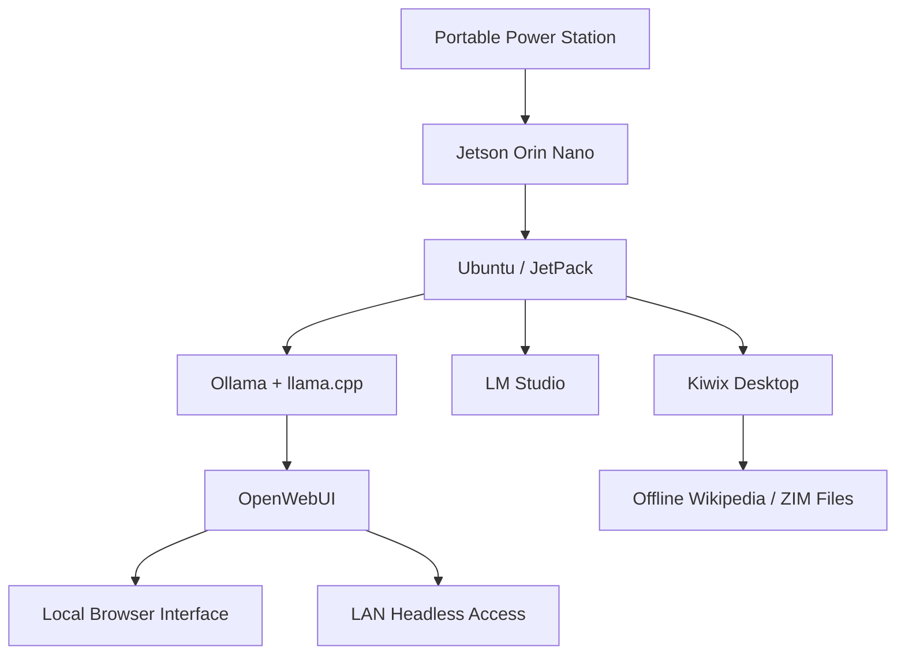

# POCKET

**Portable Offline Computing Kit for Edge Technology**

POCKET is a portable, offline, privacy-preserving edge AI system designed to give users local access to AI tools, reference data, and computing resources without relying on cloud services or subscription-based platforms. The project combines embedded hardware, local large language model inference, offline knowledge databases, and a portable power system into a compact laptop-like device.

This repository contains documentation, setup notes, system diagrams, testing data, and supporting files for the POCKET senior design project.

---

## Project Overview

Modern AI tools are increasingly dependent on cloud infrastructure, network access, and paid subscription services. POCKET explores an alternative approach by placing AI inference and offline data access directly on user-owned hardware.

The system is built around the NVIDIA Jetson Orin Nano platform and is designed to operate as a self-contained portable computer. It supports local language model inference, offline Wikipedia access through Kiwix, and a browser-based AI interface that can be accessed directly from the device or over a local network.

The goal of POCKET is not to replace high-performance cloud AI, but to demonstrate that useful AI tools can run locally in situations where privacy, ownership, portability, or network independence matter.

---

## Core Features

* Local AI inference without cloud dependency
* Offline access to Wikipedia and other Kiwix ZIM resources
* Browser-based AI interface through OpenWebUI
* Local model management with Ollama and llama.cpp
* Optional LM Studio interface for local model testing
* Portable 14-inch display and Bluetooth keyboard interface
* Headless LAN mode for remote access from another device
* Battery-powered operation using a portable power station
* Solar charging compatibility through an external solar panel
* Local-first design focused on privacy and user ownership

---

## Hardware

The POCKET prototype is built using a portable embedded computing platform with a display, storage, keyboard, and power system integrated into a weatherproof enclosure.

### Main Components

| Component                           | Description                                         |
| ----------------------------------- | --------------------------------------------------- |
| NVIDIA Jetson Orin Nano Super 8GB   | Main edge computing platform for local AI inference |
| 14-inch portable display            | Primary user interface display                      |
| Bluetooth keyboard                  | Portable text input device                          |
| SK hynix BC711 128GB NVMe 2230 SSD  | Boot drive                                          |
| Samsung 990 EVO Plus 2TB NVMe SSD   | Local model, document, and offline data storage     |
| Weatherproof enclosure              | Physical housing for the portable system            |
| PROGENY 300W portable power station | Battery source for mobile operation                 |
| MARBERO 30W solar panel             | Supplemental solar charging source                  |

### Suggested Hardware Figures

Use the following figures in the final paper or GitHub documentation:

* `openbody` — internal layout of the open enclosure
* `pcb` — board-level or power/system wiring layout
* `jetson` — close-up figure of the Jetson Orin Nano compute platform

Suggested figure captions:

**Open Body Layout:** Internal layout of the POCKET prototype showing the display, embedded compute platform, storage, and supporting hardware inside the portable enclosure.

**PCB and Wiring Layout:** Hardware wiring and board-level organization used to connect the compute platform, display, storage, and power delivery components.

**Jetson Compute Platform:** NVIDIA Jetson Orin Nano Super 8GB used as the main embedded computing platform for local AI inference and offline data access.

---

## Software Stack

POCKET uses a Linux-based local AI stack designed to support both graphical and headless operation.

### Operating System

* Ubuntu on NVIDIA Jetson
* JetPack 6.x environment
* ARM64 software stack

### AI and Interface Tools

| Tool          | Role                                                          |
| ------------- | ------------------------------------------------------------- |
| OpenWebUI     | Browser-based interface for local AI access                   |
| Ollama        | Local model serving and model management                      |
| llama.cpp     | Local inference backend with CUDA acceleration when available |
| LM Studio     | Graphical local model testing interface                       |
| Kiwix Desktop | Offline access to Wikipedia and ZIM knowledge files           |
| Docker        | Containerized OpenWebUI deployment                            |

---

## System Architecture

POCKET is organized around five major layers:

1. **Power System** — battery, charging, regulation, and external power input
2. **Compute Hardware** — Jetson Orin Nano, NVMe storage, display, keyboard, and peripherals
3. **Operating System** — Ubuntu and JetPack running on ARM64 hardware
4. **AI and Data Stack** — Ollama, llama.cpp, OpenWebUI, LM Studio, and Kiwix
5. **User Interface** — local display, keyboard, browser UI, and LAN-based headless access

### Basic Flow



---

## Local AI Modes

POCKET supports multiple AI usage modes depending on the user interface and performance requirements.

### OpenWebUI / Ollama Mode

This mode provides a browser-based interface for local AI models. OpenWebUI runs in Docker and connects to Ollama running on the Jetson host.

Typical use case:

* Local chatbot interface
* LAN-based access from another laptop or phone
* GPU-accelerated inference through llama.cpp when configured correctly
* Better energy efficiency than CPU-only inference

Example container configuration:

```bash
docker run -d \
  --name open-webui \
  -p 3000:8080 \
  -e OLLAMA_BASE_URL=http://host.docker.internal:11434 \
  --add-host=host.docker.internal:host-gateway \
  -v open-webui:/app/backend/data \
  ghcr.io/open-webui/open-webui:main
```

### LM Studio Mode

LM Studio provides a graphical model testing environment. On the JetPack 6.x setup used in this project, LM Studio was primarily useful for CPU-based model testing because GPU acceleration required a newer CUDA runtime than the one available on the tested Jetson software environment.

Typical use case:

* Simple local model testing
* Graphical interface demonstration
* Baseline CPU-only performance comparison

### Kiwix Offline Knowledge Mode

Kiwix allows POCKET to serve as an offline reference device. Wikipedia and other ZIM files can be stored locally on the 2TB NVMe drive and accessed without an internet connection.

Typical use case:

* Offline Wikipedia access
* Emergency reference system
* Educational use in low-connectivity environments
* Local knowledge base demonstration

---

## Headless LAN Mode

POCKET can also operate without relying only on the attached display. In headless mode, another device on the same local network can access the OpenWebUI interface through a browser.

Example access pattern:

```text
Client Device --> Local Network --> POCKET Jetson --> OpenWebUI --> Ollama / llama.cpp
```

Example browser URL:

```text
http://<jetson-ip-address>:3000
```

This allows POCKET to function as a portable local AI server for nearby devices.

---

## Testing and Validation

The project was tested using power, performance, and usability measurements.

### Power Testing

Power testing was performed across multiple Jetson power modes:

* 7W
* 15W
* 25W
* MAXNSUPER

Measurements were collected using Jetson system telemetry tools such as `tegrastats`. The main power measurement used for board-level power analysis was `VDD_IN`.

### AI Performance Testing

Model testing compared CPU-only inference through LM Studio against GPU-accelerated inference through the OpenWebUI, Ollama, and llama.cpp workflow.

Example observed performance trends:

| Mode                           | Approximate Throughput | Notes                                    |
| ------------------------------ | ---------------------: | ---------------------------------------- |
| LM Studio CPU-only             |          ~7.5 tokens/s | Useful baseline, higher energy per token |
| OpenWebUI / Ollama / llama.cpp |        ~33–35 tokens/s | Better throughput and energy efficiency  |

### Energy Efficiency

Energy per token was used to compare the efficiency of local inference modes.

General equation:

```text
Energy per token = total energy consumed / number of generated tokens
```

Observed trend:

* CPU-only inference consumed more energy per generated token.
* GPU-accelerated inference provided higher throughput and lower energy per token.
* The 25W power mode provided a useful balance between performance and power consumption.

---

## Demo Outline

The final POCKET demonstration includes three main parts.

### 1. Hardware Walkthrough

* Show the physical enclosure
* Identify the Jetson Orin Nano
* Show the display, keyboard, storage, and power system
* Explain how the device is powered
* Explain how the system can operate offline

### 2. Local AI Demonstration

* Launch LM Studio or OpenWebUI
* Load a small local model
* Ask a demonstration question
* Show that the response is generated locally
* Explain the difference between CPU-only and GPU-accelerated operation

### 3. Offline Knowledge Demonstration

* Open Kiwix Desktop
* Load an offline Wikipedia ZIM file
* Search for a topic without internet access
* Explain how POCKET can be useful in low-connectivity environments

### 4. Headless Mode Video Demonstration

* Show another device accessing POCKET over the LAN
* Open the OpenWebUI browser interface
* Demonstrate that POCKET can act as a local AI server

---

## Repository Structure

Suggested repository structure:

```text
POCKET/
├── README.md
├── docs/
│   ├── paper/
│   ├── poster/
│   ├── figures/
│   └── diagrams/
├── hardware/
│   ├── photos/
│   ├── wiring/
│   └── enclosure/
├── software/
│   ├── openwebui/
│   ├── ollama/
│   ├── llama-cpp/
│   └── scripts/
├── testing/
│   ├── power/
│   ├── inference/
│   └── results/
└── demo/
    ├── hardware-demo-outline.md
    ├── headless-mode-demo.md
    └── kiwix-demo.md
```

---

## Setup Notes

### Install Docker

```bash
sudo apt update
sudo apt install docker.io
sudo systemctl enable docker
sudo systemctl start docker
```

### Add User to Docker Group

```bash
sudo usermod -aG docker $USER
```

Log out and log back in after running this command.

### Start Ollama

```bash
ollama serve
```

### Run OpenWebUI

```bash
docker run -d \
  --name open-webui \
  -p 3000:8080 \
  -e OLLAMA_BASE_URL=http://host.docker.internal:11434 \
  --add-host=host.docker.internal:host-gateway \
  -v open-webui:/app/backend/data \
  ghcr.io/open-webui/open-webui:main
```

### Access OpenWebUI

From the Jetson:

```text
http://localhost:3000
```

From another device on the LAN:

```text
http://<jetson-ip-address>:3000
```

---

## Known Limitations

* LM Studio GPU acceleration was limited by CUDA version compatibility on the tested JetPack 6.x environment.
* Larger models are constrained by the Jetson Orin Nano 8GB memory capacity.
* Local inference performance depends heavily on model size, quantization, memory bandwidth, and power mode.
* Battery life depends on total system draw, including the Jetson, display, keyboard, storage, and power conversion losses.
* Full RAG integration with Kiwix ZIM files was explored but not fully completed in the current prototype.

---

## Future Work

* Improve local document retrieval and RAG support
* Add automated startup scripts for AI and Kiwix services
* Improve power regulation and internal battery integration
* Add a cleaner web dashboard for switching between modes
* Test additional models and quantization formats
* Improve enclosure mounting and cable management
* Add solar charging performance tests
* Expand offline knowledge datasets beyond Wikipedia

---

## Academic Context

POCKET was developed as a senior design project in Electrical and Computer Engineering. The project focuses on embedded AI, edge computing, local-first software design, power-aware computing, and portable system integration.

The project demonstrates how embedded computing platforms can support useful AI workflows while preserving privacy and reducing dependence on cloud infrastructure.

---

## Contributors

* Chris Langfitt
* Dilen Minstry

---

## License

Public Commons

---

## Acknowledgements

This project was supported by faculty guidance, senior design feedback, and the Electrical and Computer Engineering program. Additional acknowledgements should be added for advisors, instructors, lab support, and project reviewers.
